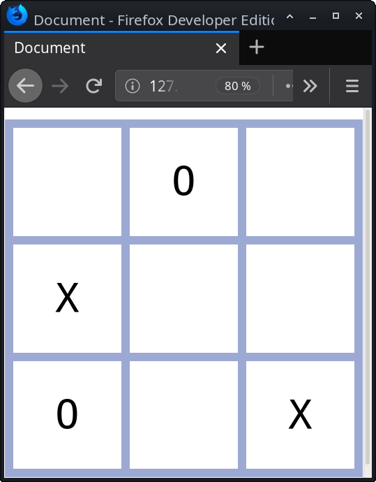

% TD : My Nice Lesson Title
% Rodrigo SCHWENCKE, schwencke@lyceeperier.fr

# First Some code Exemples with Massilia Dark Theme

Command to type in Terminal:
```{.bash}
md2all -dark exampleDark.md
```

```{.html .numberLines}
    <body>
        <div class="box">
            <div class="morpion">
                <div class="case">X</div>
                <div class="case">Y</div>
                <div class="case">Z</div>
                <div class="case">A</div>
                <div class="case">B</div>
                <div class="case">C</div>
                <div class="case">T</div>
                <div class="case">U</div>
                <div class="case">V</div>
            </div>
        </div>
    </body>
```

```{.html .numberLines startFrom="9"}
<!DOCTYPE html>
<html lang="fr">
<head>
    <meta charset="UTF-8">
    <meta name="viewport" content="width=device-width, initial-scale=1.0">
    <meta http-equiv="X-UA-Compatible" content="ie=edge">
    <title>Document</title>
</head>
<body>
    
</body>
</html>
```

```{.css .numberLines}
 body, p, .warning, .inlinewarning {
	 font-family: "Souvenir Lt Bt", Andika, "Amerigo BT", Century, "Bookman URW", "Bitstream Vera Serif", "Free Sans", Georgia, Serif, Aerial, "Times New Roman", "STSong", "PT Serif";
	 line-height: 1.5rem;
 }
 
 .toc-title {
	 color:red;
 }

 p, ul {
	 text-align: justify;
	 margin : 0.1rem 0 0 0;
 }
```

```{.javascript .numberLines startFrom="14"}
var codeClasses = [];
    var codesList = document.querySelectorAll('code.sourceCode');
    for (var i = 0; i < codesList.length; i++) {
        codeClasses.push(codesList[i].classList[1]);
        codesList[i].classList.add("language-"+codeClasses[i]);
    }
```

```{.php .numberLines  startFrom="4"}
<?php
echo "Hello World!";
?>
```

# Python Code

```{.python .numberLines}
#!/usr/bin/env python

"""
Pandoc filter to process code blocks with class "graph" into
graphviz-generated images.
Requires pygraphviz, pandocfilters
"""

import os
import sys

import pygraphviz

from pandocfilters import toJSONFilter, Para, Image, get_filename4code
from pandocfilters import get_caption, get_extension, get_value

def document_name():
    if "PANDOC_INPUT_FILE" in os.environ:
        return os.environ["PANDOC_INPUT_FILE"]
    else:
        return "graph"
```

# LateX
Hello, this is how to insert LaTeX code in your .md File, as a math inline formula $\sqrt 4  = 2$ , so this line goes on after the other inline formula $i^2$, or, as a block code:
$$i_0=1; i_1=2$$
That's it!

# Matplotlib

```{.pyplot .imgbox}
import matplotlib.pyplot as plt

plt.figure()
plt.plot([0,1,2,3,4], [1,2,3,4,5])
plt.title('This is an example figure')
```

# Graphviz

Some .dot syntax code:

```{.graph .center .imgbox caption="This was generated using the graphviz.py filter." name="jolifichier.svg"}
digraph G {

  bgcolor="#ffffff00"

  subgraph cluster_0 {
    style="filled, rounded";
    color="#E6EAF2"
    node [style=filled,color=white];
    a0 -> a1 -> a2 -> a3;
    a3 -> a1 [label = " -10" color=red fontcolor=red];
    label = "System A";
  }

  subgraph cluster_1 {
    node [style=filled color="#E6EAF2"];
    b0 -> b1 -> b2 -> b3;
    b0 -> b2 [label = " +12" color=green fontcolor=green];
    label = "System B";
    style="dashed, rounded"
    color=blue
  }

  start -> a0;
  start -> b0;
  a1 -> b3;
  a3 -> end;
  b3 -> end;

  start [label="load" shape=folder];
  end [label="store" shape=box3d];
}
```

# PlantUML

Here's somme UML code:

```{.plantuml .center caption="test" name="jolifichier.uml"}
@startuml
actor client
node app
database db

db -> app
app -> client
@enduml
```

# Multi-Columns

First Normal Paragraph

\

Second Normal Paragraph

::: cols

::: col12
Column 1, Normal Paragraph. Column 1, Normal Paragraph. Column 1, Normal Paragraph
:::

::: col22
Column 2, Normal Paragraph. Column 2, Normal Paragraph. Column 2, Normal Paragraph
:::

:::

Middle Paragraph. Middle Paragraph. Middle Paragraph. Middle Paragraph. Middle Paragraph. Middle Paragraph. 

::: cols

::: col13
Column 1, Normal Paragraph. Column 1, Normal Paragraph. Column 1, Normal Paragraph
:::

::: col23
Column 2, Normal Paragraph. Column 2, Normal Paragraph. Column 2, Normal Paragraph
:::

::: col33
Column 3, Normal Paragraph. Column 3, Normal Paragraph. Column 3, Normal Paragraph
:::

:::

Last Normal Paragraph. Last Normal Paragraph. Last Normal Paragraph.

Last Normal Paragraph. Last Normal Paragraph. Last Normal Paragraph.

# Images

{width="60%}

{height="40%}

{style="width:80px;height:50px;"}

{.noimgbox width="60%} 

{myAttribute="myValue" height="40%}

{style="width:80px;height:50px;"}
